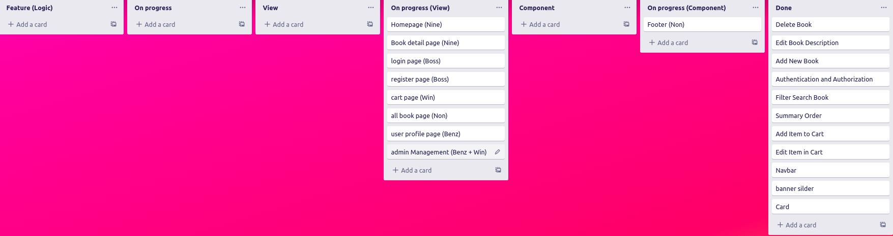

# Feature Planning (Trello)
[Trello](https://trello.com/b/F0d8WIJd/feature) <-- Click Here

last modified @ 24 march 2023

 

# Figma Design
[FigmaDesign](https://www.figma.com/file/KnPvfhgXbEzDCtDbK6kv9Z/e-book?node-id=0%3A1&t=5BTvm1etsIqcerSq-1) <-- Click Here

 

# What problems did our team encounter?
Every issue we encounter each week will be included in the <b>[issues](https://github.com/Nine0512/PROJECT2-SEC-2-Alumilize/issues/1)</b>

 

# Responsibilities of each person in _week 1_
_This week we focus on logic design and way of thinking. to wait to learn more content in the next lesson_

- 074 :  [Worawit Limthong](https://www.github.com/win2114)
	- sumary cart
- 099 :  [Natdanai Nitipan](https://www.github.com/c3bosskung)
	- authentication and authorization
-   101 :  [Thaninpong Panthawong](https://www.github.com/nonybueno)
	- search book filter
-   102 :  [Thanwa Plaengman](https://www.github.com/Nine0512)
	- CRUD E-book in stock
-   106 :  [Preeyaporn Petcharat](https://www.github.com/Preeyapornn)
	- add remove items in cart

# Responsibilities of each person in _week 2 - 3_
_In these 2 weeks, we learned about router and fetch, so let's split the task to make view and some additional components._

###### In this week we found json-server can filter and search with parameter we will adapt it with our project :)

- 074 :  [Worawit Limthong](https://www.github.com/win2114)
	- cart page (view) and admin Management (view)
- 099 :  [Natdanai Nitipan](https://www.github.com/c3bosskung)
	- sign in and sign up (view)
-   101 :  [Thaninpong Panthawong](https://www.github.com/nonybueno)
	- footer (component) and all book page (view)
-   102 :  [Thanwa Plaengman](https://www.github.com/Nine0512)
	- Homepage (view), Book detail Page (view), Card(component), Navbar(component) and Banner Slide(component)
-   106 :  [Preeyaporn Petcharat](https://www.github.com/Preeyapornn)
	- user profile page (view) and admin Management (view)

